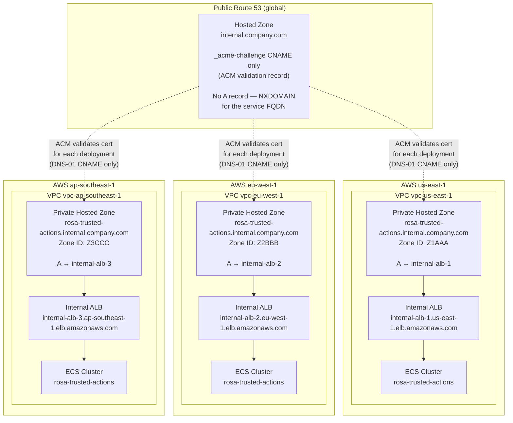
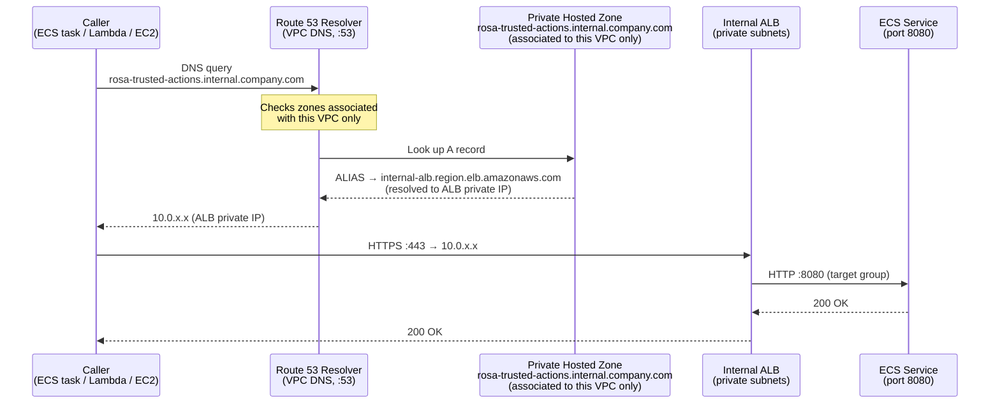
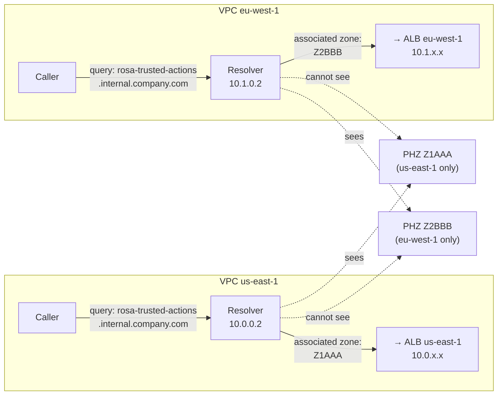
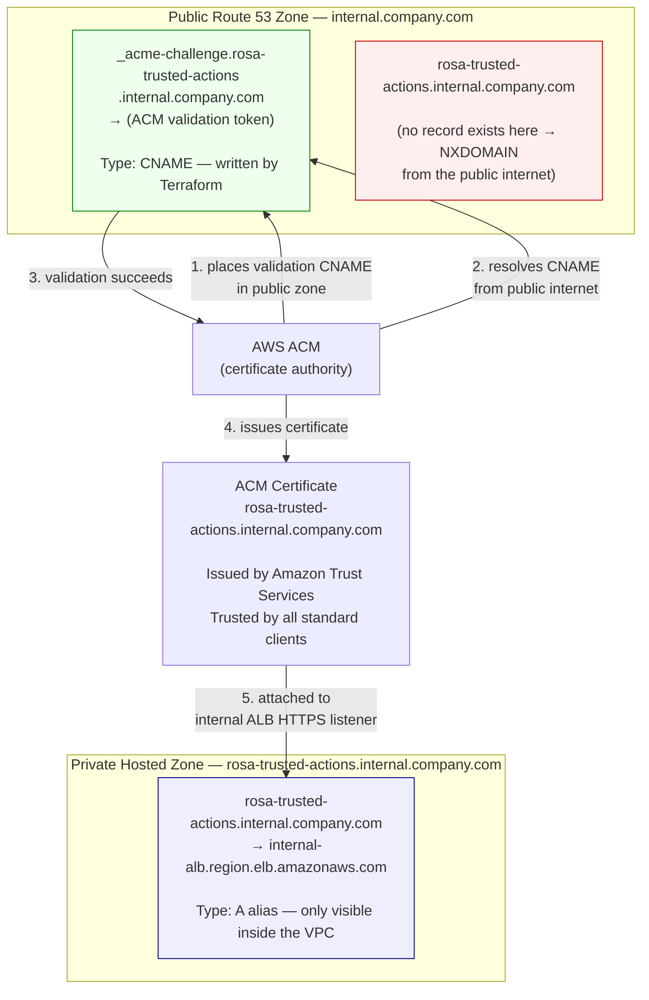
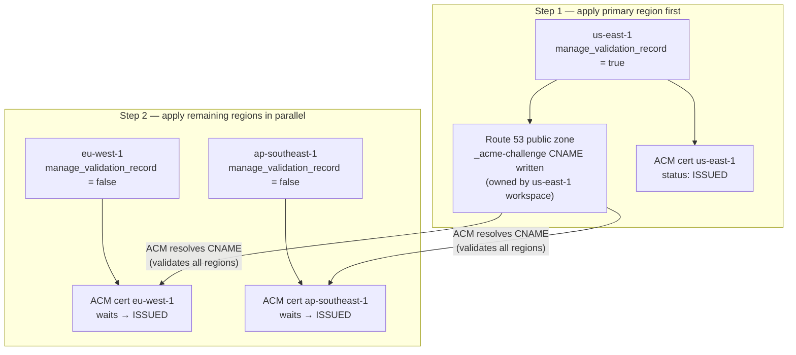

# Private Networking & DNS Architecture

This document explains how the ROSA Trusted Actions Server exposes a stable,
VPC-internal FQDN across multiple regional deployments without any public DNS
entry or publicly reachable endpoint, and how TLS certificates are issued for
that private name.

---

## Table of Contents

1. [Overview](#overview)
2. [Multi-Region Architecture](#multi-region-architecture)
3. [DNS Resolution Inside a VPC](#dns-resolution-inside-a-vpc)
4. [Cross-Region Isolation](#cross-region-isolation)
5. [TLS Certificates — The Shadow Zone Pattern](#tls-certificates--the-shadow-zone-pattern)
6. [Multi-Region Deployment Order](#multi-region-deployment-order)
7. [Terraform Variable Reference](#terraform-variable-reference)

---

## Overview

The service is deployed once per AWS region. Each regional deployment is
completely self-contained: it has its own VPC, its own internal Application
Load Balancer (ALB), and its own Route 53 Private Hosted Zone (PHZ).

Every deployment uses the **same FQDN** — for example
`rosa-trusted-actions.internal.company.com` — but that name resolves to a
**different ALB** depending on which VPC the caller is in. Traffic never
crosses a regional boundary at the DNS layer.

This is the same model Kubernetes uses for internal service URLs
(`my-service.my-namespace.svc.cluster.local`), implemented entirely with AWS
primitives.

---

## Multi-Region Architecture



**Key points:**

- The three Private Hosted Zones have identical names but different Zone IDs.
  AWS Route 53 identifies zones by ID, not by name, so there is no conflict.
- Each PHZ is associated exclusively with one VPC. Route 53 Resolver inside
  that VPC only sees its own zone.
- The public hosted zone contains **no A record** for the service FQDN — only
  the ACM validation CNAME (explained below). The name is publicly
  unresolvable (NXDOMAIN).

---

## DNS Resolution Inside a VPC

When any workload inside a VPC queries `rosa-trusted-actions.internal.company.com`,
AWS routes the query through the VPC's built-in Route 53 Resolver (always
available at the VPC base CIDR + 2, e.g. `10.0.0.2`). The resolver looks up
all Private Hosted Zones associated with the querying VPC and answers from the
matching zone — entirely within the VPC, with no public DNS involved.



**What makes this VPC-local:**

- `enable_dns_support = true` on the VPC tells EC2 instances and containers
  to use the Route 53 Resolver at VPC+2 instead of a custom DNS server.
- `enable_dns_hostnames = true` allows ALB DNS names to resolve within the VPC.
- The PHZ association scope is a single VPC. Queries from outside that VPC
  receive no answer from this zone — the zone is invisible to them.

---

## Cross-Region Isolation

The same FQDN exists in three separate Private Hosted Zones. Because each zone
is associated with exactly one VPC, a caller in `us-east-1` cannot resolve the
`eu-west-1` zone even if both zones have the same name.



There is no routing policy, no latency-based record, and no failover. The
isolation is enforced structurally by the PHZ association scope — not by
configuration that could be misconfigured.

---

## TLS Certificates — The Shadow Zone Pattern

Let's Encrypt and ACM public certificates both support a **DNS-01** validation
challenge: instead of serving a file over HTTP, you prove domain ownership by
placing a specific CNAME record in your DNS zone. Critically, the validation
server only needs to **resolve** that CNAME — it never makes an HTTP request to
the service itself.

This means a certificate can be issued for a name that has no public A record,
as long as the DNS-01 CNAME is in a publicly resolvable zone. The service
endpoint can remain entirely private.



**Why this is safe:**

| What the public internet can see | What it cannot reach |
|---|---|
| `_acme-challenge.rosa-trusted-actions...` CNAME (ACM validation) | Any A record for the service |
| Certificate in Certificate Transparency logs | The service itself |
| That a certificate was issued | Any response from the ALB |

The certificate is issued by Amazon Trust Services and is trusted by all
standard TLS clients without any custom CA distribution — unlike a fully
private CA approach (AWS Private CA), which would require distributing a root
certificate to every caller.

**ACM auto-renewal** works identically: ACM re-places the CNAME, re-validates
through the public zone, and rotates the certificate — no manual intervention,
no service disruption.

---

## Multi-Region Deployment Order

Every regional deployment issues its own ACM certificate (ACM is a regional
service; an ALB in `eu-west-1` cannot use a certificate from `us-east-1`).
Because all certs cover the same FQDN, ACM computes an **identical** DNS-01
validation CNAME for each of them. That CNAME is a single record in the shared
public Route 53 zone — it is global infrastructure, not per-region.

This creates a hard constraint: the validation CNAME must be owned by exactly
one Terraform workspace. If every workspace tried to create and destroy the
same record independently, parallel applies would race on shared state and
parallel destroys would delete a record that surviving regions still need for
certificate auto-renewal.

### The `manage_validation_record` variable

The variable `manage_validation_record` (type `bool`, default `false`) controls
which workspace owns the CNAME record.

- **Exactly one region** sets `manage_validation_record = true`. This workspace
  creates the `aws_route53_record.cert_validation` resource and owns it in
  Terraform state. By convention this is the **primary region** (the one that
  must be applied first).
- **All other regions** leave `manage_validation_record = false`. They create
  their own ACM certificate and then wait for ACM to report it as `ISSUED`,
  which happens automatically once the CNAME placed by the primary region is
  in place. They never touch the shared Route 53 record and hold no Terraform
  dependency on it, so they can apply and destroy fully in parallel.



### Workspace variable summary

```
# us-east-1 — primary, apply first
internal_fqdn             = "rosa-trusted-actions.internal.company.com"
public_zone_id            = "Z0123456789ABC"
manage_validation_record  = true

# eu-west-1 — secondary, apply after us-east-1
internal_fqdn             = "rosa-trusted-actions.internal.company.com"
public_zone_id            = "Z0123456789ABC"
manage_validation_record  = false   # ← default; CNAME already exists

# ap-southeast-1 — secondary, apply after us-east-1
internal_fqdn             = "rosa-trusted-actions.internal.company.com"
public_zone_id            = "Z0123456789ABC"
manage_validation_record  = false   # ← default; CNAME already exists
```

### Destruction order

Destruction is the mirror image of deployment:

1. **Destroy secondary regions first** (in parallel, `manage_validation_record
   = false`). Their workspaces do not own the CNAME, so destroying them leaves
   the record intact.
2. **Destroy the primary region last** (`manage_validation_record = true`).
   This workspace deletes the CNAME as the final step, at which point no other
   regional deployment remains that could need it for certificate renewal.

If the primary region is destroyed while secondary regions are still running,
the validation CNAME disappears and ACM will be unable to auto-renew the
surviving certificates when they approach expiry.

### Transferring ownership

If the primary region must be decommissioned while other regions remain live,
transfer ownership before destroying it:

1. Set `manage_validation_record = true` in a different region and apply that
   workspace — the record already exists so Terraform will adopt it into the
   new workspace's state.
2. Set `manage_validation_record = false` in the old primary and apply — the
   record is removed from that workspace's state but **not deleted from Route
   53** (because another workspace now owns it).
3. Destroy the old primary region normally.

---

## Terraform Variable Reference

| Variable | Default | Purpose |
|---|---|---|
| `internal_fqdn` | `""` | Full private FQDN, e.g. `rosa-trusted-actions.internal.company.com`. Creates the PHZ and (with `public_zone_id`) the ACM certificate. |
| `public_zone_id` | `""` | Route 53 hosted zone ID for the **public** apex zone. Only the ACM DNS-01 CNAME is written here — no A record. |
| `manage_validation_record` | `false` | Set `true` in exactly one regional deployment (the primary). That workspace owns and manages the shared ACM validation CNAME. All other regions must be `false`. |
| `alb_certificate_arn` | `""` | Bypass for manual certificate management. Set instead of `public_zone_id` when the apex zone is not in Route 53. |
